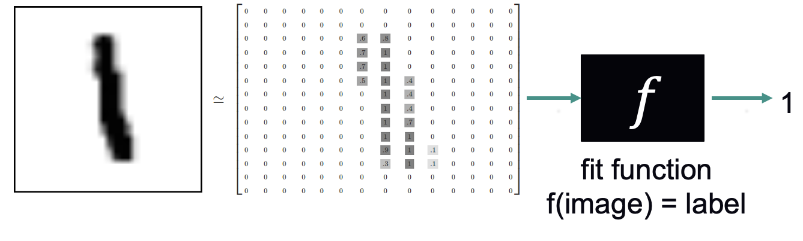

# Introduction to deep learning
ATPESC 2026

Author: Huihuo Zheng (huihuo.zheng@anl.gov), adapting materials from Bethany Lusch, Marieme Ngom, Prasanna Balaprakash, Taylor Childers, Corey Adams, and Kyle Felker.

This is a hands-on introduction to deep learning, a machine learning technique that tends to outperform other techniques when dealing with a large amount of data. 

This is a quick overview, but the goals are:
- to introduce the fundamental concepts of deep learning through hands-on activities
- to give you the necessary background for the more advanced topics on scaling and performance that we will teach later today.

Some rough definitions:

- Artificial intelligence (AI) is a set of approaches to solving complex problems by imitating the brain's ability to learn.
- Machine learning (ML) is the field of study that gives computers the ability to learn without being explicitly programmed (i.e. learning patterns instead of writing down rules.) Arguably, machine learning is now a subfield of AI.


Ready for more?
- Here are some of our longer training materials: https://www.alcf.anl.gov/alcf-ai-science-training-series
- Here's a thorough hands-on textbook: [book](https://www.oreilly.com/library/view/hands-on-machine-learning/9781492032632/) with [notebooks](https://github.com/ageron/handson-ml2).

We will work on a classification problem involving the [MNIST dataset](https://huggingface.co/datasets/ylecun/mnist) that contains thousands of examples of handwritten numbers, with each digit labeled 0-9. The model is learning to "classify" images as one of ten classes.


We are going to run Jupyter notebooks. You can run them in Google Colab (see instructions [here](../README.md)). If that's a problem you can also use your own computer or ALCF's [JupyterHub](https://docs.alcf.anl.gov/services/jupyter-hub/).

## Running as a batch job on Polaris (PBS)

`01_introduction_mnist.py` and `02_conv_networks.py` are non-interactive
versions of the two notebooks above (same models, same training), for anyone
who wants a reproducible run outside the live session instead of Colab/
JupyterHub. Differences from the notebooks: matplotlib uses the "Agg" backend
and saves figures to `$OUTDIR` instead of displaying them inline, tensors move
to CUDA when available, and the open-ended "train NonlinearClassifier"
exercise in the first notebook is filled in so the script runs end-to-end
unattended.

Clone this repo onto Polaris (e.g. under `/eagle/ATPESC2026/<your-username>/`)
and submit `run.sh` from this directory:

```bash
cd 01_intro_to_deep_learning
qsub run.sh
```

The script requests 1 node (`-A ATPESC2026`, `-q debug` by default; see the
comment at the top of `run.sh` for switching to the `ATPESC`/`ATPESC-Night`
reservation queues during the actual session) and takes well under 20 minutes
total. Polaris compute nodes have no outbound internet by default, so `run.sh`
sets the ALCF proxy env vars before the MNIST download.
