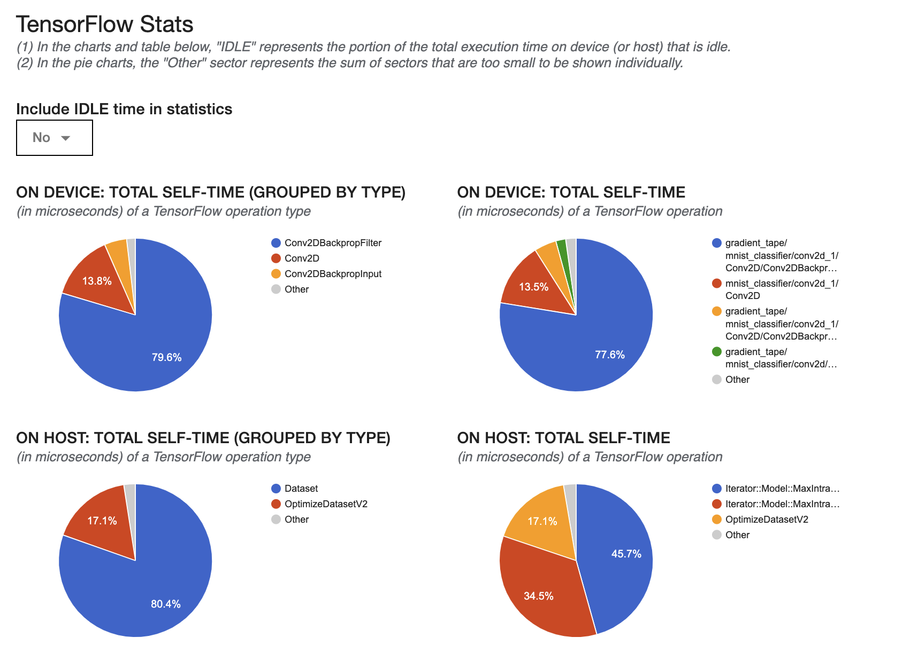

# Reduced and Mixed Precision

*Note*: for a more extensive discussion and tutorial related to mixed precision training of neural networks, refer to [CPW21: Reduced and Mixed Precision](https://github.com/argonne-lcf/CompPerfWorkshop-2021/tree/main/10_reduced-precision).

Switching to reduced or mixed precision is not that hard in TensorFlow's Keras API:
```python
tf.keras.mixed_precision.set_global_policy("mixed_float16")
```

In this case, there are also a bunch of places where I hard-coded `float32` - oops!  Fix those too. The final layer (softmax) should **not** used mixed precision.

In general, loss scaling should be used to prevent numerical underflow (and sometimes overflow) when using `float16`. See [the TensorFlow guide to Mixed Precision](https://www.tensorflow.org/guide/mixed_precision#training_the_model_with_a_custom_training_loop) for more details. 

Now run the code with mixed precision and the default Keras loss scale optimizer (both XLA and profiling are disabled here):
```
python train_MNIST_tf_function_XLA_mixed.py --epochs 1 --batch_size 1024

...
2021-08-10 02:35:00,466 - INFO - (0, 46), Loss: 0.11277, step_time: 0.00532, throughput: 1.93e+05 img/s.
2021-08-10 02:35:00,473 - INFO - (0, 47), Loss: 0.08135, step_time: 0.00533, throughput: 1.92e+05 img/s.
2021-08-10 02:35:00,485 - INFO - (0, 48), Loss: 0.10929, step_time: 0.01039, throughput: 9.85e+04 img/s.
2021-08-10 02:35:00,493 - INFO - (0, 49), Loss: 0.10958, step_time: 0.00538, throughput: 1.90e+05 img/s.
2021-08-10 02:35:00,500 - INFO - (0, 50), Loss: 0.09276, step_time: 0.00539, throughput: 1.90e+05 img/s.
2021-08-10 02:35:00,508 - INFO - (0, 51), Loss: 0.09720, step_time: 0.00543, throughput: 1.88e+05 img/s.
2021-08-10 02:35:00,515 - INFO - (0, 52), Loss: 0.07887, step_time: 0.00538, throughput: 1.90e+05 img/s.
2021-08-10 02:35:00,523 - INFO - (0, 53), Loss: 0.06713, step_time: 0.00526, throughput: 1.95e+05 img/s.
```
The performance has gotten significantly worse (5x slower than before). Quick investigation reveals that the _dynamic_ loss scaling optimizer is responsible for the degradation. Typically, such default, automated loss scaling is relatively inexpensive and should be used. However, with such a simple network architecture and training loop, the local work is so small and the image throughput is so high, that even this small extra cost can harm your peak efficiency.

Comment out the default `LossScaleOptimizer` and use the one with `dyanmic=False`:
```
    # Dynamic loss scaling (more expensive, but more reliable)
    #opt = tf.keras.mixed_precision.LossScaleOptimizer(tf.keras.optimizers.Adam(_lr))
    # Fixed loss scaling (cheap)
    opt = tf.keras.mixed_precision.LossScaleOptimizer(
        tf.keras.optimizers.Adam(_lr),
        dynamic=False,
        initial_scale=1024,
    )
``` 
If you use too large of an `initial_scale`, the loss function will return NaNs. Using a fixed scale of 1024 seems fairly robust for our case:
```
2021-08-10 02:30:46,418 - INFO - (0, 48), Loss: 0.08706, step_time: 0.00100, throughput: 1.02e+06 img/s.
2021-08-10 02:30:46,425 - INFO - (0, 49), Loss: 0.10371, step_time: 0.00101, throughput: 1.02e+06 img/s.
2021-08-10 02:30:46,432 - INFO - (0, 50), Loss: 0.09754, step_time: 0.00100, throughput: 1.03e+06 img/s.
2021-08-10 02:30:46,438 - INFO - (0, 51), Loss: 0.09409, step_time: 0.00099, throughput: 1.03e+06 img/s.
2021-08-10 02:30:46,445 - INFO - (0, 52), Loss: 0.06493, step_time: 0.00101, throughput: 1.01e+06 img/s.
2021-08-10 02:30:46,451 - INFO - (0, 53), Loss: 0.05253, step_time: 0.00100, throughput: 1.03e+06 img/s.
2021-08-10 02:30:46,458 - INFO - (0, 54), Loss: 0.07965, step_time: 0.00100, throughput: 1.02e+06 img/s.
2021-08-10 02:30:46,465 - INFO - (0, 55), Loss: 0.06847, step_time: 0.00100, throughput: 1.02e+06 img/s.
```

This is disappointing!  Just like with XLA, we ran with mixed precision and it is slightly SLOWER.  Let's look into the profile to discover why.

Here's the overview page.  We note right away that in the bottom left, it IS using a good amount of reduced precision.


Scrolling down:


Compared to the float32 top-10 operations, this is pretty different.  There is one op that is particularly dominant!  It is still a conv2d operation, but for some reason it is much slower than the others.

Here is the Kernel Statistics page again:


We see the same problem there - except this time it's pointing to the wgrad convolution. The TensorFlow Statistics shows similar info:



And there is also a timeline view of all ops (trace viewer)


And zoomed:


So, reduced precision appears to be slower because of one particular operation.  How to
fix this?  Well the best solution here is probably to open a bug report.
