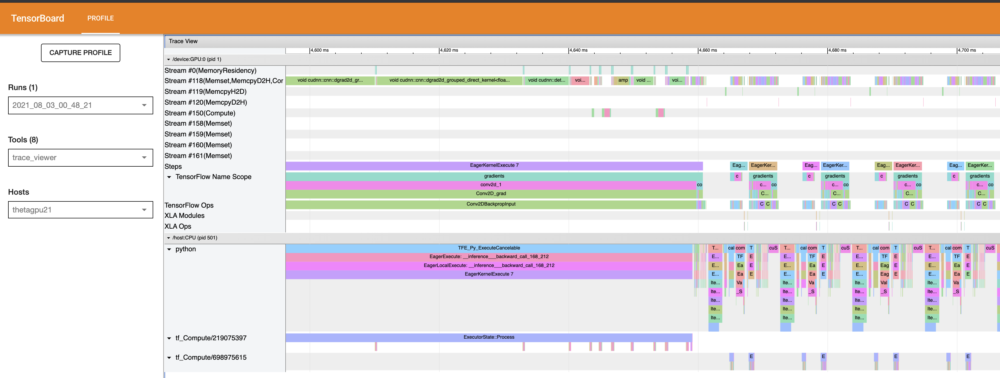

# TF Profiling Tool


Note the lines `tf.profiler.experimental.start('logdir')` and `tf.profiler.experimental.stop()` in the code.  This sets up and tears down the profiling tool built in to TensorFlow.  See the screenshots below - the main operation is conv2D backprop - a very compute heavy operation.  We may get some performance improvement further with reduced precision - see the [`reduced_precision/`](../reduced_precision) folder.


# Running the TensorFlow Profiler

When you've captured your profile data, TensorBoard will dump it into the folder `logdir` (as above) and you will have to view it.  The simplest way, for this application, is to copy it to your own laptop if you have TensorFlow installed.  If not, you can run TensorBoard on ThetaGPU and use SSH port forwarding to view it on your own laptop.

Whatever you do, you can open TensorBoard like so:
```
tensorboard --load_fast=false --logdir [your/own/path/to/logdir/]
```
For my local macOS system with TensorFlow 2.5.0, TensorBoard did not show any data unless the experimntal fast loading logic (which theoretically offers 100x-400x shorter loading times) was disabled. See  https://github.com/tensorflow/tensorboard/issues/4784

Next, open your browser and navigate to `localhost:6006` (or, whatever port you forwarded to) and you'll see a screen like the one below:


And, if you scroll down, you'll see the list of the top 10 most time consuming operations:


This list shows us that the top operations are largely all convolution ops (particularly backprop).  The profiler at the top also points out that 0% of the graph is in reduced precision, which could give us a speedup.  We'll try that next but first let's review the other tabs:

Here is the Kernel Statistics page:


Again, this shows that the convolution operations are all the most dominant and equally distributed (roughly).

The TensorFlow statistics shows similar info:


And there is also a timeline view of all ops (trace viewer)


And zoomed:



Now, let's try running in reduced precision.


# Using Port Forwarding

You can view the processes and how they occupy the compute resources in Tensorflow using tensorboard.

You can login to Polaris using:
```bash
# our proxy port, must be > 1024
export PORT=10001
# login to theta with a port forwarding
ssh -D $PORT user@polaris.alcf.anl.gov
# load any conda environment that has a compatible tensorboard installation
module load conda/2022-09-08
conda activate
cd <path/to/dataPipelines/00_tensorflowDatasetAPI/>
# start tensorboard (load_fast==false is a recent setting that seems to be needed until Tensorflow work's out the bugs)
tensorboard --bind_all --logdir logdir
```
Note the Port number that `tensorboard` reports when it starts up.

Only 1 user can use a specific port so if you get an error choose another port number larger than `1024`.

Once you have that setup. Set the Socks5 proxy of your favorite browser to host `localhost` and port `$PORT` (where `$PORT` is the value you used in the above script, like `10001`). Now in the browser URL enter the login node on which you started `tensorboard`. For instance, if you are on `polaris`, now you can type in `polaris.alcf.anl.gov:6006`. Here `6006` is the port that `tensorboard` uses by default to start up it's web service, but may vary if that port is already used so note the port reported by `tensorboard` when it starts.
