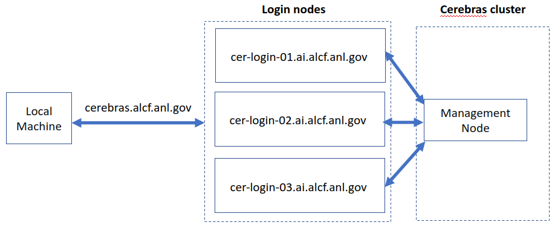

# Cerebras 

## Connection to a CS-2 node

Connection to one of the CS-2 cluster login nodes requires an MFA passcode for authentication - either an 8-digit passcode generated by an app on your mobile device (e.g. MobilePASS+) or a CRYPTOCard-generated passcode prefixed by a 4-digit pin. 



To connect to a CS-2 login, ssh to login nodes:
```bash
ssh ALCFUserID@cerebras.ai.alcf.anl.gov
```

## Create Virtual Environment 

### PyTorch virtual environment
Create a PyTorch virtual environment for Cerebras
```bash
mkdir ~/R_2.2.1
cd ~/R_2.2.1
# Note: "deactivate" does not actually work in scripts.
deactivate
/software/cerebras/python3.8/bin/python3.8 -m venv venv_cerebras_pt
source venv_cerebras_pt/bin/activate
pip install --upgrade pip
pip install cerebras_pytorch==2.2.1
```
## Clone Cerebras modelzoo

We use example from [Cerebras Modelzoo repository](https://github.com/Cerebras/modelzoo) for this hands-on. 
Clone the modezoo repository.<br>

```bash
mkdir ~/R_2.2.1 # Only if directory does not exist.
cd ~/R_2.2.1
git clone https://github.com/Cerebras/modelzoo.git
cd modelzoo
git tag
git checkout Release_2.2.1
```

## Job Queuing and Submission

The CS-2 cluster has its own Kubernetes-based system for job submission and queuing. Jobs are started automatically through the Python scripts. 

Use Cerebras cluster command line tool to get addional information about the jobs.

* Jobs that have not yet completed can be listed as
    `(venv_pt) $ csctl get jobs`
* Jobs can be canceled as shown:
    `(venv_tf) $ csctl cancel job wsjob-eyjapwgnycahq9tus4w7id`

See `csctl -h` for more options.

## Run Examples

Refer to the instructions in the file below to run GPT-J model.
<!--- * [FC-MNIST](./fc-mnist.md)
* [BERT-Large](./bert-large.md) --->
* [GPT-J](./gpt-j.md)

# Useful Resources 

* [ALCF Cerebras Documentation](https://docs.alcf.anl.gov/ai-testbed/cerebras/system-overview/)
* [Cerebras Documntation](https://docs.cerebras.net/en/latest/wsc/index.html)
* [Cerebras Modelzoo Repo](https://github.com/Cerebras/modelzoo/tree/main/modelzoo)
* Datasets Path: `/software/cerebras/dataset`
