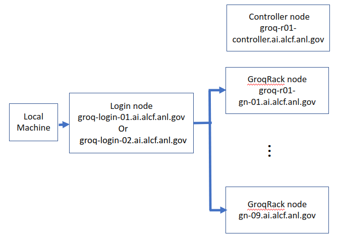

# Groq 

## Connection to Groq



Login to the Groq login node from your local machine.
Once you are on the login node, ssh to one of the Groq nodes.

```bash
local > ssh ALCFUserID@groq.ai.alcf.anl.gov
```
```bash
groq-login > ssh groq-r01-gn-01.ai.alcf.anl.gov
# or
groq-login > ssh groq-r01-gn-09.ai.alcf.anl.gov
# or any node with hostname of form groq-r01-gn-0[1-9].ai.alcf.anl.gov
```

## Create Virtual Environment 

### Install Miniconda

```bash
wget https://repo.anaconda.com/miniconda/Miniconda3-latest-Linux-x86_64.sh
bash Miniconda3-latest-Linux-x86_64.sh
```

### PyTorch virtual environment

```bash
export PYTHON_VERSION=3.10.12
conda create -n groqflow python=$PYTHON_VERSION -y
conda activate groqflow
```

### Install Groqflow

```bash
# Alter this if you have cloned groqflow to some other location.
cd ~/groqflow
if [ -d "groqflow.egg-info" ]; then rm -r groqflow.egg-info; fi
pip install --upgrade pip
pip list --format=freeze > frozen.txt
pip install -r frozen.txt -e .
pushd . 
cd demo_helpers
if [ -d "groqflow_demo_helpers.egg-info" ]; then rm -r groqflow_demo_helpers.egg-info; fi
pip install -e .
popd
pip install soundfile
```


## Job Queuing and Submission

Groq jobs in the AI Testbed's groqrack are managed by the PBS job scheduler.

* `qsub` : to submit a batch job using a script
* `qstat`: to display queue information
* `qdel`: to delete (cancel) a job:
* `qhold`: to hold a job

### Schedule batch Job

<details>
  <summary>Create a sample run_minilmv2.sh script as below</summary>

    #!/bin/bash
    # >>> conda initialize >>>
    # !! Contents within this block are managed by 'conda init' !!
    __conda_setup="$(${HOME}'/miniconda3/bin/conda' 'shell.bash' 'hook' 2> /dev/null)"
    if [ $? -eq 0 ]; then
        eval "$__conda_setup"
    else
        if [ -f "${HOME}/miniconda3/etc/profile.d/conda.sh" ]; then
            . "${HOME}/miniconda3/etc/profile.d/conda.sh"
        else
            export PATH="${HOME}/miniconda3/bin:$PATH"
        fi
    fi
    unset __conda_setup
    # <<< conda initialize <<<
    conda activate groqflow
    cd ~/groqflow/proof_points/natural_language_processing/minilm
    pip install -r requirements.txt
    python minilmv2.py
    
</details>

Ensure you have a groqflow conda environment activated.
```bash
conda activate groqflow
```

Then run the script as a batch job with PBS. This will reserve a full eight-card(chip) node.
```bash
qsub -l  select=1,place=excl run_minilmv2.sh
```


### Schedule Interactive Job

Following command gives a single Groq node interactively for 1 hour
```bash
qsub -I -l walltime=1:00:00 
```
Other flags that can be used
```bash
-l ncpus=1 
-l groq_accelerator=1
```

Then activate your groqflow environment, and run python scripts with
```bash
conda activate groqflow
cd ~/groqflow/proof_points/natural_language_processing/minilm
pip install -r requirements.txt
python minilmv2.py
```
<!--- ## Run Examples

Refer to respective instrcutions below 
* [ResNet50](./resnet50.md)
* [MiniLMv2](./minilm.md) --->


## Useful Resources 

* [ALCF Groq Documenation](https://docs.alcf.anl.gov/ai-testbed/groq/system-overview/)
* [Groq Documentation](https://support.groq.com/#/login)
* [Groq Examples Repository](https://github.com/groq/groqflow/tree/main/proof_points)

