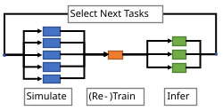
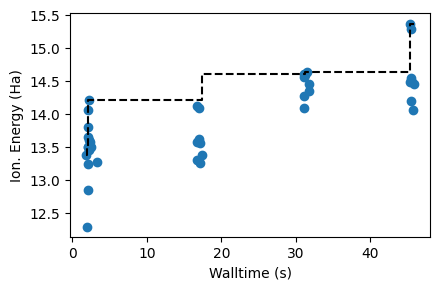

# Molecular design ML-in-the-loop workflow with Parsl

This demo shows a simple molecular design application where we use machine learning to guide which computations we perform.
The objective of this application is to identify which molecules have the largest ionization energies (IE, the amount of energy required to remove an electron).

This demo is adapted from the ExaWorks demo [molecular-design-parsl-demo](https://github.com/ExaWorks/molecular-design-parsl-demo/tree/main).

IE can be computed using various simulation packages (here we use [xTB](https://xtb-docs.readthedocs.io/en/latest/contents.html) ); however, execution of these simulations is expensive, and thus, given a finite compute budget, we must carefully select which molecules to explore. We use machine learning to predict high IE molecules based on previous computations (a process often called [active learning](https://pubs.acs.org/doi/abs/10.1021/acs.chemmater.0c00768)). We iteratively retrain the machine learning model to improve the accuracy of predictions. The resulting ML-in-the-loop workflow proceeds as follows. 



In this notebook, we use Parsl to execute functions (simulation, model training, and inference) in parallel. Parsl allows us to establish dependencies in the workflow and to execute the workflow on arbitrary computing infrastructure, from laptops to supercomputers. We show how Parsl's integration with Python's native concurrency library (i.e., [`concurrent.futures`](https://docs.python.org/3/library/concurrent.futures.html#module-concurrent.futures)) let you write applications that dynamically respond to the completion of asynchronous tasks.


## Getting Started

This demo is designed to be run interactively on an Aurora node (although more nodes could be used).

Start by getting an interactive compute node:
```shell
qsub -I -A ATPESC2025 -q ATPESC -l select=1 -l walltime=0:60:0 -l filesystems=home:flare
```

Once your interactive job has started, activate the demo environment:
```shell
module load frameworks
conda activate /flare/ATPESC2025/EXAMPLES/track3-workflows/_demo_env
```

If you would like to build the demo environment at a later date, the included `environment.yml` file can be used.

## Problem Dependencies

This demo is adapted from the ExaWorks [molecular-design-parsl-demo](https://github.com/ExaWorks/molecular-design-parsl-demo/tree/main) demo.  It makes use of a module [`chemfunctions`](./chemfunctions/chemfunctions.py) written for that demo and included here in this repo with some updates.

The data directory contains molecules from the QM9 database for our analysis.  The structure of each molecule is represented as a string of characters called a [SMILES string](https://archive.epa.gov/med/med_archive_03/web/html/smiles.html). 


## Set up Parsl

We first configure Parsl to make use of available resources. In this case, we configure Parsl to run on one Aurora compute node. This problem does not use GPUs, so we set one woker per CPU for a total of 102 workers.  For a GPU application, we would change the `Config` to pin one worker per GPU.  You can pin one worker per GPU tile on Aurora by setting `available_accelerators` in the `HighThroughputExecutor` to a list of tile names, e.g. `['0.0','0.1','1.0',...]`.

One of the benefits of Parsl is that we can change this configuration to make use of different resources without modifying the following workflow. For example, we can configure Parsl to use more cores on the local machine or to use many nodes on a Supercomputer or Cloud. The [Parsl website](https://parsl.readthedocs.io/en/stable/userguide/configuring.html) describes how Parsl can be configured for different resources.

The Parsl Config is in the file `parsl_config.py`.

```python title="parsl_config.py"
import os
import parsl
from parsl.executors import HighThroughputExecutor
from parsl.providers import LocalProvider
from parsl.launchers import MpiExecLauncher
from parsl.config import Config

# Get the number of nodes from the PBS_NODEFILE
pbs_node_file = os.getenv('PBS_NODEFILE')
num_nodes = 1
with open(pbs_node_file, 'r') as nf:
    nodes = nf.readlines()
    num_nodes = len(nodes)

# For this cpu only config, bind one worker per cpu core
# cpu_affinity will have the form 'list:1,105:2,106:...'
cpu_affinity = "list"
num_cpus = 2
num_cores_per_cpu = 51 # first core on each cpu is reserved for system procs and should not be used
for cpu in range(num_cpus):
    core_start = cpu*52
    for core in range(num_cores_per_cpu):
        cpu_affinity += f":{core_start+core+1},{core_start+core+1+104}"

# Parsl config for cpu workers
aurora_config = Config(
    executors=[
        HighThroughputExecutor(
            max_workers_per_node=102, # We will use 102 workers, one for each CPU core
            cpu_affinity=cpu_affinity,  # Prevents thread contention
            prefetch_capacity=0,  # Increase if you have many more tasks than workers
            provider=LocalProvider(
                launcher=MpiExecLauncher(
                    bind_cmd="--cpu-bind", overrides="--ppn 1"
                ),  # Ensures 1 manger per node and allows it to divide work to all 64 cores
                nodes_per_block=num_nodes,
                init_blocks=1,
                max_blocks=1,
            ),
        ),
    ]
)

```


## Make an initial dataset

We need data to train our ML models. We'll do that by selecting a set of molecules at random from our search space, performing some simulations on those molecules, and training on the results.

In [`chemfunctions.py`](./chemfunctions.py), we have defined a function `compute_vertical` that computes the "vertical ionization energy" of a molecule (a measure of how much energy it takes to strip an electron off the molecule). `compute_vertical` takes a string representation of a molecule in [SMILES format](https://en.wikipedia.org/wiki/Simplified_molecular-input_line-entry_system) as input and returns the ionization energy as a float. Under the hood, it is running [xTB](https://xtb-docs.readthedocs.io/en/latest/contents.html) to perform a series of quantum chemistry computations.

### Execute a first simulation
We need to prepare this function to run with Parsl. All we need to do is wrap this function with Parsl's `python_app`:

```python
compute_vertical_app = python_app(compute_vertical)
```

This new object is a Parsl `PythonApp`. It can be invoked like the original function, but instead of immediately executing, the function may be run asynchronously by Parsl. Instead of the result, the call will immediately return a `Future` which we can use to retrieve the result or obtain the status of the running task.

For example, invoking the `compute_verticle_app` with the SMILES for water, `O`, returns a Future and schedules `compute_verticle` for execution in the background.


```python
future = compute_vertical_app('O') #  Run water as a demonstration (O is the SMILES for water)
```

We can access the result of this computation by asking the future for the `result()`. If the computation isn't finished yet, then the call to `.result()` will block until the result is ready.

```python
ie = future.result()
```

To test running the simulation, run `0_run_simulation.py`:

```python title="0_run_simulation.py"
from chemfunctions import compute_vertical
from parsl_config import aurora_config
import parsl
from parsl.app.app import python_app

compute_vertical_app = python_app(compute_vertical)

if __name__ == "__main__":
    with parsl.load(aurora_config):
        future = compute_vertical_app('O') #  Run water as a demonstration (O is the SMILES for water)
        print("The python app returns a future object:", future)

        ie = future.result()
        print(f"The ionization energy of {future.task_record['args'][0]} is {ie:.2f} eV")
```

### Scale the simulation

It is trivial now to scale our simulation and run it for several different molecules and gather their results.

We use a standard Python loop to submit a set of simulations for execution. As above, each invocation returns a `Future` immediately, so this code should finish within a few milliseconds.

Because we never call `.result()`, this code does not wait for any results to be ready. Instead, Parsl is running the computations in the background. Parsl manages sending work to each worker process, collecting results, and feeding new work to workers as new tasks are submitted.

```python
smiles = search_space.sample(initial_count)['smiles']
futures = [compute_vertical_app(s) for s in smiles]
```

The futures produced by Parsl are based on Python's [native "Future"](https://docs.python.org/3/library/concurrent.futures.html#future-objects) object,
so we can use Python's utility functions to work with them.

As an example, we can build a loop that submits new computations if previous ones fail. This happens not too infrequently with our simulation application.

We use `as_completed` to take an iterable (in this case a list) of futures and to yeild as each future completes.  Thus, we progress and handle each simulation as it completes

We also use, `Future.exception()` rather than the similar `Future.result()`. `Future.exception()` behaves similarly in that it will block until the relevant task is completed, but rather than return the result, it returns any exception that was raised during execution (or `None` if not). In this case, if the future returns an exception we simply pick a new molecule and re-execute the simulation.


```python
train_data = []
while len(futures) > 0: 
    # First, get the next completed computation from the list
    future = next(as_completed(futures))
    
    # Remove it from the list of still-running tasks
    futures.remove(future)
    
    # Get the input 
    smiles = future.task_record['args'][0]
    
    # Check if the run completed successfully
    if future.exception() is not None:
        # If it failed, pick a new SMILES string at random and submit it    
        print(f'Computation for {smiles} failed, submitting a replacement computation')
        smiles = search_space.sample(1).iloc[0]['smiles'] # pick one molecule
        new_future = compute_vertical_app(smiles) # launch a simulation in Parsl
        futures.append(new_future) # store the Future so we can keep track of it
    else:
        # If it succeeded, store the result
        print(f'Computation for {smiles} succeeded')
        train_data.append({
            'smiles': smiles,
            'ie': future.result(),
            'batch': 0,
            'time': monotonic()
        })
train_data = pd.DataFrame(train_data)
```

We now have an initial set of training data. We load this training data into a pandas `DataFrame` containing the randomly samples molecules alongside the simulated ionization energy (`ie`). In addition, the code above has stored some metadata (`batch` and `time`) which we will use later.


## Train a machine learning model to screen candidate molecules
Our next step is to create a machine learning model to estimate the outcome of new computations (i.e., ionization energy) and use it to rapidly scan the search space.

To start, let's make a function that uses our prior simulations to train a model. We are going to use RDKit and scikit-learn to train a nearest-neighbor model that uses Morgan fingerprints to define similarity (see [notes from a UChicago AI course](https://github.com/WardLT/applied-ai-for-materials/blob/main/molecular-property-prediction/chemoinformatics/2_ml-with-fingerprints.ipynb) for more detail). In short, the function trains a model that first populates a list of certain substructures (Morgan fingerprints, specifically) and then trains a model which predicts the IE of a new molecule by averaging those with the most similar substructures.

We want to use Parsl here to scale the model and to later combine it into our ML-in-the-loop workflow. To do so, we define the function using `python_app`. This time, `python_app` is used as a decorator directly on the function definition (earlier we defined a regular function, and then applied `python_app` afterwards).


```python
@python_app
def train_model(train_data):
    """Train a machine learning model using Morgan Fingerprints.
    
    Args:
        train_data: Dataframe with a 'smiles' and 'ie' column
            that contains molecule structure and property, respectfully.
    Returns:
        A trained model
    """
    # Imports for python functions run remotely must be defined inside the function
    from chemfunctions import MorganFingerprintTransformer
    from sklearn.neighbors import KNeighborsRegressor
    from sklearn.pipeline import Pipeline
    
    
    model = Pipeline([
        ('fingerprint', MorganFingerprintTransformer()),
        ('knn', KNeighborsRegressor(n_neighbors=4, weights='distance', metric='jaccard', n_jobs=-1))  # n_jobs = -1 lets the model run all available processors
    ])
    
    return model.fit(train_data['smiles'], train_data['ie'])
```

One of the unique features of Parsl is that it can create workflows on-the-fly directly from Python. Parsl workflows are chains of functions, connected by dynamic depencies (i.e., data passed between Parsl `apps`), that can run in parallel when possible.

To establish the workflow, we pass the future created by executing one function an input to another Parsl function.

As an example, let's create a function that uses the trained model to run inference on a large set of molecules and then another that takes many predictions and concatenates them into a single collection. The sequential workflow is implemented as follows.

        train_model --> run_model --> combine_inferences


```python
@python_app
def run_model(model, smiles):
    """Run a model on a list of smiles strings
    
    Args:
        model: Trained model that takes SMILES strings as inputs
        smiles: List of molecules to evaluate
    Returns:
        A dataframe with the molecules and their predicted outputs
    """
    import pandas as pd
    pred_y = model.predict(smiles)
    return pd.DataFrame({'smiles': smiles, 'ie': pred_y})
```


```python
@python_app
def combine_inferences(inputs=[]):
    """Concatenate a series of inferences into a single DataFrame
    Args:
        inputs: a list of the component DataFrames
    Returns:
        A single DataFrame containing the same inferences
    """
    import pandas as pd
    return pd.concat(inputs, ignore_index=True)
```

Now we've defined our Parsl `apps`, we can chop up the search space into chunks, and invoke `run_model`  once for each chunk of the search space.

Note: we pass `train_future` (the future created from the training function above) as input to `run_model`. Parsl will wait for the training to be complete (i.e., the future to be resolved) before executing `run_model`.

Script `1_training_and_inference.py` combines app futures to exeucute these apps with their dependencies:

```python title="1_training_and_inference.py"
from parsl_config import aurora_config
from chemfunctions import compute_vertical
import parsl
from parsl.app.app import python_app
from time import monotonic
from random import sample
import pandas as pd
import numpy as np
from concurrent.futures import as_completed

# This example will
# 1. Collect training data by running several simulations
# 2. Train a model using the training data
# 3. Run the model on a large search space of molecules to predict their properties

# Model training app
@python_app
def train_model(train_data):
    """Train a machine learning model using Morgan Fingerprints.
    
    Args:
        train_data: Dataframe with a 'smiles' and 'ie' column
            that contains molecule structure and property, respectfully.
    Returns:
        A trained model
    """
    # Imports for python functions run remotely must be defined inside the function
    from chemfunctions import MorganFingerprintTransformer
    from sklearn.neighbors import KNeighborsRegressor
    from sklearn.pipeline import Pipeline
    
    
    model = Pipeline([
        ('fingerprint', MorganFingerprintTransformer()),
        ('knn', KNeighborsRegressor(n_neighbors=4, weights='distance', metric='jaccard', n_jobs=-1))  # n_jobs = -1 lets the model run all available processors
    ])
    
    return model.fit(train_data['smiles'], train_data['ie'])

# Inference app to run the model on a list of SMILES strings
@python_app
def run_model(model, smiles):
    """Run a model on a list of smiles strings
    
    Args:
        model: Trained model that takes SMILES strings as inputs
        smiles: List of molecules to evaluate
    Returns:
        A dataframe with the molecules and their predicted outputs
    """
    import pandas as pd
    pred_y = model.predict(smiles)
    return pd.DataFrame({'smiles': smiles, 'ie': pred_y})

# Convenience app to combine multiple inferences into a single DataFrame
@python_app
def combine_inferences(inputs=[]):
    """Concatenate a series of inferences into a single DataFrame
    Args:
        inputs: a list of the component DataFrames
    Returns:
        A single DataFrame containing the same inferences
    """
    import pandas as pd
    return pd.concat(inputs, ignore_index=True)

# Simulation app to compute the ionization energy of a molecule
compute_vertical_app = python_app(compute_vertical)

# Search space of molecules to sample from
search_space = pd.read_csv('./data/QM9-search.tsv', sep='\s+')  # Our search space of molecules
initial_count: int = 16  # Number of calculations to run at first

if __name__ == "__main__":

    # Load the Parsl configuration
    with parsl.load(aurora_config):

        start_time = monotonic()  # Start a timer to measure how long the simulations take

        # Create training data by running several simulations
        # randomly sample molecules from the search space to simulate
        smiles = search_space.sample(initial_count)['smiles']
        futures = [compute_vertical_app(s) for s in smiles]
        print(f'Submitted {len(futures)} simulations to start with')

        # Now we wait for the calculations to complete to populate training data
        train_data = []
        while len(futures) > 0:
            # First, get the next completed computation from the list
            future = next(as_completed(futures))
            
            # Remove it from the list of still-running tasks
            futures.remove(future)
            
            # Get the input 
            smiles = future.task_record['args'][0]
            
            # Check if the run completed successfully
            if future.exception() is not None:
                # If it failed, pick a new SMILES string at random and submit it    
                print(f'Computation for {smiles} failed, submitting a replacement computation')
                smiles = search_space.sample(1).iloc[0]['smiles'] # pick one molecule
                new_future = compute_vertical_app(smiles) # launch a simulation in Parsl
                futures.append(new_future) # store the Future so we can keep track of it
            else:
                # If it succeeded, store the result
                print(f'Computation for {smiles} succeeded')
                train_data.append({
                    'smiles': smiles,
                    'ie': future.result(),
                    'batch': 0,
                    'time': monotonic() - start_time
                })
        print("Training data collected.")
        train_data = pd.DataFrame(train_data)
        print(train_data)
        print("Starting training and inference.")
        
        # Train model
        train_future = train_model(train_data)

        # Chunk the search space into smaller pieces, so that each inference task can run in parallel
        chunks = np.array_split(np.array(search_space['smiles']), 102)
        # Create inference tasks, we can pass the train_future to the funtion
        inference_futures = [run_model(train_future, chunk) for chunk in chunks]

        # We pass the inputs explicitly as a named argument "inputs" for Parsl to recognize this as a "reduce" step
        #  See: https://parsl.readthedocs.io/en/stable/userguide/workflow.html#mapreduce
        predictions = combine_inferences(inputs=inference_futures).result()
        print("Training and inference completed.")
        print("Inference predictions:")
        print(predictions)
```

While this script runs inferences in parallel we can define the final part of the workflow to combine results into a single DataFrame using `combine_inferences`.

We pass the `inference_futures` as inputs to `combine_inferences` such that Parsl knows to establish a dependency between these two functions. That is, Parsl will ensure that `train_future` must complete before any of the `run_model` tasks start; and all of the `run_model` tasks must be finished before `combine_inferences` starts.

#### Results

After completing the inference process we now have predicted IE values for all molecules in our search space. We can print out the best five molecules, according to the trained model:

```python
predictions.sort_values('ie', ascending=False).head(5)
```

We have now created a Parsl workflow that is able to train a model and use it to identify molecules that are likely to be good next choices for simulations. Time to build a model-in-the-loop workflow.

## Model-in-the-Loop Workflow
We are going to build an application that uses a machine learning model to pick a batch of simulations, runs the simulations in parallel, and then uses the data to retrain the model before repeating the loop.

Our application uses `train_model`, `run_model`, and `combine_inferences` as above, but after running an iteration it picks the predicted best molecules and runs the `compute_vertical_app` to run the xTB simulation.  The workflow then repeatedly retrains the model using these results until a fixed number of molecule simulations have been trained. 

Script `2_ml_in_the_loop.py` puts all these pieces together:

```python title="2_ml_in_the_loop.py"
from parsl_config import aurora_config
from chemfunctions import compute_vertical
from matplotlib import pyplot as plt
import parsl
from parsl.app.app import python_app
from time import monotonic
from random import sample
import pandas as pd
import numpy as np
from concurrent.futures import as_completed
from pathlib import Path


# Model training app
@python_app
def train_model(train_data):
    """Train a machine learning model using Morgan Fingerprints.
    
    Args:
        train_data: Dataframe with a 'smiles' and 'ie' column
            that contains molecule structure and property, respectfully.
    Returns:
        A trained model
    """
    # Imports for python functions run remotely must be defined inside the function
    from chemfunctions import MorganFingerprintTransformer
    from sklearn.neighbors import KNeighborsRegressor
    from sklearn.pipeline import Pipeline
    
    
    model = Pipeline([
        ('fingerprint', MorganFingerprintTransformer()),
        ('knn', KNeighborsRegressor(n_neighbors=4, weights='distance', metric='jaccard', n_jobs=-1))  # n_jobs = -1 lets the model run all available processors
    ])
    
    return model.fit(train_data['smiles'], train_data['ie'])

# Inference app to run the model on a list of SMILES strings
@python_app
def run_model(model, smiles):
    """Run a model on a list of smiles strings
    
    Args:
        model: Trained model that takes SMILES strings as inputs
        smiles: List of molecules to evaluate
    Returns:
        A dataframe with the molecules and their predicted outputs
    """
    import pandas as pd
    pred_y = model.predict(smiles)
    return pd.DataFrame({'smiles': smiles, 'ie': pred_y})

# Convenience app to combine multiple inferences into a single DataFrame
@python_app
def combine_inferences(inputs=[]):
    """Concatenate a series of inferences into a single DataFrame
    Args:
        inputs: a list of the component DataFrames
    Returns:
        A single DataFrame containing the same inferences
    """
    import pandas as pd
    return pd.concat(inputs, ignore_index=True)

# Simulation app to compute the ionization energy of a molecule
compute_vertical_app = python_app(compute_vertical)

# Search space of molecules to sample from
search_space = pd.read_csv('./data/QM9-search.tsv', sep='\s+')  # Our search space of molecules
initial_count: int = 16  # Number of simulations to run for first model training
search_count: int = 64   # Number of molecules to simulate in total
batch_size: int = 8  # Number of molecules to simulate in each batch of simulations

if __name__ == "__main__":

    train_data = []

    # Load the Parsl configuration
    with parsl.load(aurora_config):

        # Mark when we started
        start_time = monotonic()

        # Start with some random guesses for simulations to create initial training data
        train_data = []
        init_mols = search_space.sample(initial_count)['smiles']
        sim_futures = [compute_vertical_app(mol) for mol in init_mols]
        already_ran = set()

        # Loop until you finish populating the initial training set of simulation results
        while len(sim_futures) > 0: 
            # First, get the next completed computation from the list
            future = next(as_completed(sim_futures))

            # Remove it from the list of still-running tasks
            sim_futures.remove(future)

            # Get the input 
            smiles = future.task_record['args'][0]
            already_ran.add(smiles)

            # Check if the run completed successfully
            if future.exception() is not None:
                # If it failed, pick a new SMILES string at random and submit it    
                smiles = search_space.sample(1).iloc[0]['smiles'] # pick one molecule
                new_future = compute_vertical_app(smiles) # launch a simulation in Parsl
                sim_futures.append(new_future) # store the Future so we can keep track of it
            else:
                # If it succeeded, store the result
                train_data.append({
                    'smiles': smiles,
                    'ie': future.result(),
                    'batch': 0,
                    'time': monotonic() - start_time
                })

        # Create the initial training set
        train_data = pd.DataFrame(train_data)

        # ML-in-the-loop
        # Run training, inference, and simulation in a loop continuously until we've simulated enough molecules
        # Each successive batch of simulations should predict higher ionization energies
        batch = 1
        while len(train_data) < search_count:
            start_loop_time = monotonic()
            print(f"Batch {batch} training on {len(train_data)} simulation results")
            
            # Train and predict as shown in the previous example.
            train_future = train_model(train_data)
            chunks = np.array_split(np.array(search_space['smiles']), 102)

            inference_futures = [run_model(train_future, chunk) for chunk in chunks]
            predictions = combine_inferences(inputs=inference_futures).result()

            # Sort inference predictions in descending order, and simulate the top ones
            predictions.sort_values('ie', ascending=False, inplace=True)
            sim_futures = []
            for smiles in predictions['smiles']:
                if smiles not in already_ran:
                    sim_futures.append(compute_vertical_app(smiles))
                    already_ran.add(smiles)
                    if len(sim_futures) >= batch_size:
                        break

            # Wait for every simulation in the current batch to complete, and store successful results
            new_results = []
            for future in as_completed(sim_futures):
                if future.exception() is None:
                    new_results.append({
                        'smiles': future.task_record['args'][0],
                        'ie': future.result(),
                        'batch': batch, 
                        'time': monotonic() - start_time
                    })
   
            # Update the training data and repeat
            batch += 1
            train_data = pd.concat((train_data, pd.DataFrame(new_results)), ignore_index=True)
            print(f"...finished loop iter in {monotonic() - start_loop_time}s")
    
    print("Simulations complete, plotting results...")
    fig, ax = plt.subplots(figsize=(4.5, 3.))
    ax.scatter(train_data['time'], train_data['ie'])
    ax.step(np.array(train_data['time']), np.array(train_data['ie'].cummax()), 'k--')
    ax.set_xlabel('Walltime (s)')
    ax.set_ylabel('Ion. Energy (Ha)')
    fig.tight_layout()
    fig.savefig('ml_in_the_loop.png', dpi=300)

    # Saving results
    Path('run-data').mkdir(exist_ok=True)
    train_data.to_csv('run-data/parsl-results.csv', index=False)

```

We can plot the training data against the time of simulation, showing that the model is finding better molecules (e.g. molecules with higher ionization energies) over time. 
    

    
