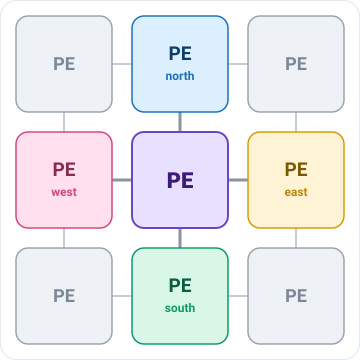
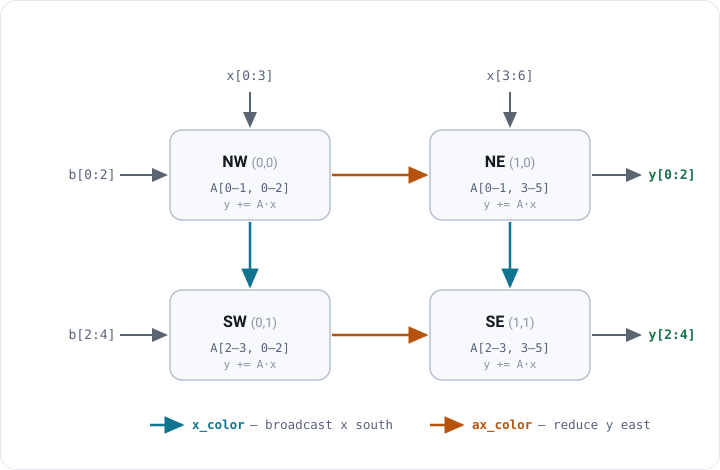

<!--
  MAINTAINER — before merging to upstream, swap the clone URL in this file
  (check with:  grep -n vksastry README.md):
    vksastry/ATPESC_MachineLearning  ->  argonne-lcf/ATPESC_MachineLearning
-->
# 🎨 Cerebras SDK & CSL — Programming the Wafer


The **WSE-3** inside the Cerebras CS-3 is a nearly million-core wafer. Beyond AI, its ultra-high
bandwidth fabric suits HPC kernels — seismic imaging, CFD, Monte Carlo particle transport, molecular
dynamics (several Gordon Bell finalists). The **Cerebras SDK** lets you write your *own* wafer-scale
kernels in **CSL** (Cerebras Software Language), programming individual PEs and the routing between them.

> [!NOTE]
> **You write two pieces:** (1) **device code** in CSL that runs on the PEs, and (2) **host code** in
> Python that moves data on/off the wafer and launches functions. You'll develop and run everything on
> the **cycle-accurate fabric simulator** — no hardware needed.

---

## 🏗️ How the wafer is organized

The WSE is a **2D rectangular mesh of Processing Elements (PEs)** — hundreds of thousands of them
(≈900,000 on the WSE-3) on a single wafer. Each PE is a tiny, independent computer that talks **only to
its four neighbors**: North, East, South, West. **There is no shared memory anywhere on the wafer.**

<p align="center">
  
</p>

<p align="center"><em>A PE talks only to its four <b>N / E / S / W</b> neighbors — a far PE is reached by hopping across the ones in between.</em></p>

**Inside one PE** there are three parts:

<p align="center">
  
</p>

- **🧮 Compute Engine (CE)** — runs your CSL instructions.
- **💾 Local memory** — ~48 KB of SRAM holding this PE's data *and* code; no other PE can touch it.
- **🔀 Router** — the PE's only link to the outside world. It connects to the four neighbor routers,
  and to its *own* CE through the **`RAMP`** link.

PEs communicate by sending **wavelets** — 32-bit messages that hop to a neighbor in a **single clock
cycle**. Every wavelet is tagged with a **color** (one of 24 channels, IDs 0–23). That color does two
jobs at once: it **decides the wavelet's route** through the mesh **and** **which task consumes it** on
arrival.

> [!IMPORTANT]
> **Writing CSL mirrors this hardware in two steps:**
> 1. **Place** your program on a rectangle of PEs — `@set_rectangle`, `@set_tile_code`.
> 2. **Route** the colors — for each color on each PE, say where wavelets enter (`.rx`) and exit
>    (`.tx`), using `RAMP` (its own CE) and the compass `EAST / WEST / NORTH / SOUTH` (neighbors).
>
> The hands-on below is exactly **step 2**: the placement is done for you — **you wire the color.** 🎨

---

## 🧭 What you'll do


---

## 🛠️ Set up the SDK

> [!IMPORTANT]
> CSL runs on a **Cerebras compute node**, not the login node — `cslc` uses a **Singularity** container
> that exists only on the compute node.  

**1. Connect** — log in, then hop to a user node:

```bash
ssh ALCFUserID@cerebras.alcf.anl.gov   # login node
ssh cer-usn-01                         # user node   (or: ssh cer-usn-02)
```

**2. Copy the SDK** into `~/ATPESC` 

```bash
mkdir -p ~/ATPESC
cp -r /software/cerebras/cs_sdk-2.10 ~/ATPESC/
```

**3. Put `cslc` on your `PATH`** 

```bash
export PATH=~/ATPESC/cs_sdk-2.10:$PATH
```

**4. Verify** (on the user node):

```bash
cslc --help
```

**5. Clone this repo** onto the node to get the hands-on files (the ALCF proxy is needed for external git):

```bash
export HTTPS_PROXY=http://proxy.alcf.anl.gov:3128
export https_proxy=http://proxy.alcf.anl.gov:3128
cd ~/ATPESC
# NOTE: development fork — on merge, swap to https://github.com/argonne-lcf/ATPESC_MachineLearning.git
git clone https://github.com/vksastry/ATPESC_MachineLearning.git
cd ATPESC_MachineLearning/04_AI_testbed/Cerebras/CSL
```

> [!NOTE]
> A **single-PE** GEMV uses **zero colors** (one processor, no network); **colors only appear the
> moment work crosses a PE boundary** — which is exactly what you'll wire below. 👇

---

## 🎨 Hands-on: GEMV on a 2×2 tile — wire the colors


📂 Files: **[`gemv-2x2/starter/`](./gemv-2x2/starter/)** — everything you need is here; you only edit `layout.csl`.
📖 Optional deep dive: **[`PE_PROGRAM_WALKTHROUGH.md`](./gemv-2x2/PE_PROGRAM_WALKTHROUGH.md)** — the device code, line by line.

### The problem

Compute `y = A·x + b` where `A` is `4×6`, spread across a **2×2 grid of PEs**. `A` splits into four
**quadrants** (one per PE), `x` is handed to the **top row**, and `b` is staged in the **left column**.
The final `y` lands in the **right column**, where the host reads it back.

<p align="center">
  
</p>

<p align="center"><em><code>x</code> enters the top row and is broadcast <b>south</b>; each PE multiplies its own quadrant; partials reduce <b>east</b> into the final <code>y</code> on the right.</em></p>

*Prefer to watch it move? Open `placement-and-compute.html` or `dataflow-viz.html` from [`gemv-2x2/`](./gemv-2x2/) in a browser — handy on the projector.*

### 🎨 The two colors

```csl
const ax_color: color = @get_color(0); // REDUCE:    partial y flows EAST
const x_color:  color = @get_color(1); // BROADCAST: x flows SOUTH
```

> [!IMPORTANT]
> Recall a **color** is a routing channel, and each PE gives it a **route**: `.rx` (where wavelets come
> in) and `.tx` (where they go out), using `RAMP` (its own core) and `EAST / WEST / NORTH / SOUTH`
> (neighbors). Here the two colors have **opposite jobs** — one fans data *out* (broadcast), the other
> funnels data *in* (reduce).

### ✅ Your task — wire the 8 routes

**Everything is written** — `pe_program.csl` (the compute), `run.py` (the host), the 2×2 placement —
**except the color routes.** Open [`gemv-2x2/starter/layout.csl`](./gemv-2x2/starter/layout.csl); each of
the **8** `@set_color_config` calls is labeled with that PE's position. Fill every
`.rx`/`.tx` from `RAMP, EAST, WEST, NORTH, SOUTH`:

| PE | position | color | `.rx` | `.tx` |
|----|----------|-------|:---:|:---:|
| `(0,0)` NW | left col · top row     | `ax_color` | ❓ | ❓ |
| `(0,0)` NW | left col · top row     | `x_color`  | ❓ | ❓ |
| `(1,0)` NE | right col · top row    | `ax_color` | ❓ | ❓ |
| `(1,0)` NE | right col · top row    | `x_color`  | ❓ | ❓ |
| `(0,1)` SW | left col · bottom row  | `ax_color` | ❓ | ❓ |
| `(0,1)` SW | left col · bottom row  | `x_color`  | ❓ | ❓ |
| `(1,1)` SE | right col · bottom row | `ax_color` | ❓ | ❓ |
| `(1,1)` SE | right col · bottom row | `x_color`  | ❓ | ❓ |

> [!TIP]
> Most routes have a single `.rx` and a single `.tx` — but **one color needs a route that delivers to
> two places at once** (a `.tx` can list several directions). Which PEs have to both *use* a value and
> *pass it along*?

### ▶️ Compile and run on the simulator

```bash
cd gemv-2x2/starter
bash commands_wse3.sh
```

This runs `cslc` (compile) then `cs_python run.py` (fabric simulation). Correct routing prints
**`SUCCESS!`**, and the computed result is `y = [17, 53, 89, 125]`.

### 🚦 What you'll see

| Signal | Meaning | Fix |
|---|---|---|
| ❌ won't compile | a `???` is still there | fill in all 8 routes |
| ⏳ hangs forever | a route doesn't line up | e.g. a top-row `x_color` missing `RAMP` → that PE never receives its own `x`, never finishes, and the reduce deadlocks. Recheck directions. |
| ✅ `SUCCESS!` | both colors route correctly | 🎉 you wired a broadcast **and** a reduce |

### 🧠 Takeaway

- A **color is a channel**, and each PE gives it its own **route**. The *same* color is a **send** on
  one PE (`RAMP → EAST`) and a **receive** on its neighbor (`WEST → RAMP`) — that's how a value crosses
  from one PE to the next.
- A `.tx` can list **more than one destination**: `.{ RAMP, SOUTH }` hands the value to the PE's own
  core *and* forwards it to the neighbor below — that's how one color **broadcasts**.
- You wired **two colors with opposite jobs** — `x_color` fans data *out* (broadcast), `ax_color`
  funnels it *in* (reduce) — entirely as **routing in `layout.csl`**. The compute in `pe_program.csl`
  is identical on every PE; only the routes differ.

---

## 📚 More information

- [ALCF Cerebras CSL guide](https://github.com/argonne-lcf/user-guides/blob/main/docs/ai-testbed/cerebras/csl.md)
- [Cerebras SDK documentation](https://sdk.cerebras.net/)
- [CSL examples repository](https://github.com/Cerebras/csl-examples)

[⬅️ Back to Cerebras overview](../README.md)
