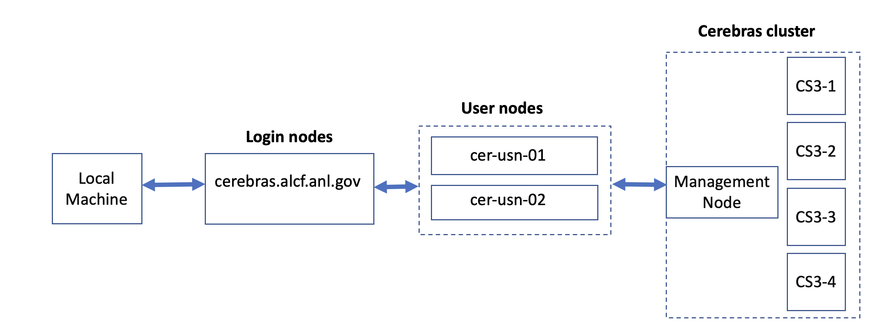

# 🌊 Cerebras CS-3 — Hands-on ML Training


Train a real GPT-3 model on a wafer-scale engine — connect, build your environment, launch a job, and
learn to read what the machine tells you. 🚀

## 🔌 Connection to a CS-3 node

Connection to one of the CS3-2 cluster login nodes requires an MFA passcode for authentication - either an 8-digit passcode generated by an app on your mobile device (e.g. MobilePASS+) or a CRYPTOCard-generated passcode prefixed by a 4-digit pin. 



To connect to a CS-3 login, ssh to login nodes:
```bash
ssh ALCFUserID@cerebras.alcf.anl.gov 
```

Then ssh to a cerebras user node:
```bash
ssh cer-usn-01
```
or
```bash
ssh cer-usn-02
```

## Create Virtual Environment 

### Clone Cerebras modelzoo

To make a PyTorch virtual environment for Cerebras, clone the Cerebras modelzoo. Check out the R 2.10.0 release. 

```bash
mkdir -p ~/ATPESC/R_2.10.0
cd ~/ATPESC/R_2.10.0
export HTTPS_PROXY=http://proxy.alcf.anl.gov:3128
export https_proxy=http://proxy.alcf.anl.gov:3128 
git clone https://github.com/Cerebras/modelzoo.git
cd modelzoo
git tag
git checkout Release_2.10.0
```

Create a PyTorch virtual environment for Cerebras
```bash
cd ~/ATPESC/R_2.10.0
/usr/bin/python3.11 -m venv venv_cerebras_pt
source venv_cerebras_pt/bin/activate
pip install --upgrade pip
pip install -e modelzoo
```

#### Activation and deactivation

To activate a virtual environment

```console
source ~/ATPESC/R_2.10.0/venv_cerebras_pt/bin/activate
```

To deactivate a virtual environment,

```console
deactivate
```

## Job Queuing and Submission

The CS-3 cluster has its own Kubernetes-based system for job submission and queuing. Jobs are started automatically through the Python scripts. 

Use Cerebras cluster command line tool to get addional information about the jobs.

* Jobs that have not yet completed can be listed as
    `(venv_pt) $ csctl get jobs`
* Jobs can be canceled as shown:
    `(venv_tf) $ csctl cancel job wsjob-eyjapwgnycahq9tus4w7id`

See `csctl -h` for more options.

## 🧪 Hands-on Session Example

> [!IMPORTANT]
> In this session you'll **launch GPT-3 training, watch it break with a NaN, and diagnose why.**
> The bug is easy to spot — but the way it resists your first fix is the real lesson. 🎯

* 🧠 **[GPT-3 111M — Break it & Fix it](./gpt3.md)**

## 🏠 Homework Time!

Ready to go deeper? Pick up where the hands-on left off. 💪

Use a **fresh `model_dir`** for every run.

- [ ] **Make your fix stick.** When you lower the learning rate and just re-run, it *still* goes to NaN —
      the checkpoint restores the old optimizer + LR-scheduler state and overrides your YAML. Get the
      model to actually train with your new LR.
      <details><summary>🔑 nudge</summary> Either start from a fresh <code>model_dir</code>, or load only the weights with the <code>LoadCheckpointStates</code> callback (<code>load_checkpoint_states: "model"</code>). Full walkthrough in <a href="./gpt3.md#-homework--make-the-new-learning-rate-actually-stick">gpt3.md</a>.</details>
- [ ] **Find the tipping point.** Starting from the healthy LR, raise it step by step —
      `6e-4 → 1e-2 → 1e-1 → 1` (fresh `model_dir` each run) — until the loss goes to NaN.
      **What's the highest LR that still trains?**
- [ ] *(Optional)* **Does warmup help?** Your config ramps the LR up from 0 over the first steps.
      Try a **constant** high LR (no warmup) versus the warmup schedule — which one diverges faster?

> [!TIP]
> Keep an eye on the logged `lr`, the loss scale, and the gradient norm — they tell you *why* a run
> behaves the way it does, long before the loss does.

## 📚 Useful Resources 

* [ALCF Cerebras Documentation](https://docs.alcf.anl.gov/ai-testbed/cerebras/)
* [Cerebras Training Documntation](https://training-docs.cerebras.ai/rel-2.4.0/getting-started/overview)
* [Cerebras Modelzoo Repo](https://github.com/Cerebras/modelzoo/tree/main/modelzoo)

* Commonly used Datasets Path on system at ALCF: `/software/cerebras/dataset`
