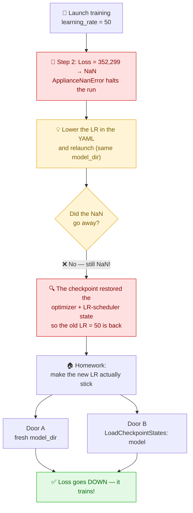
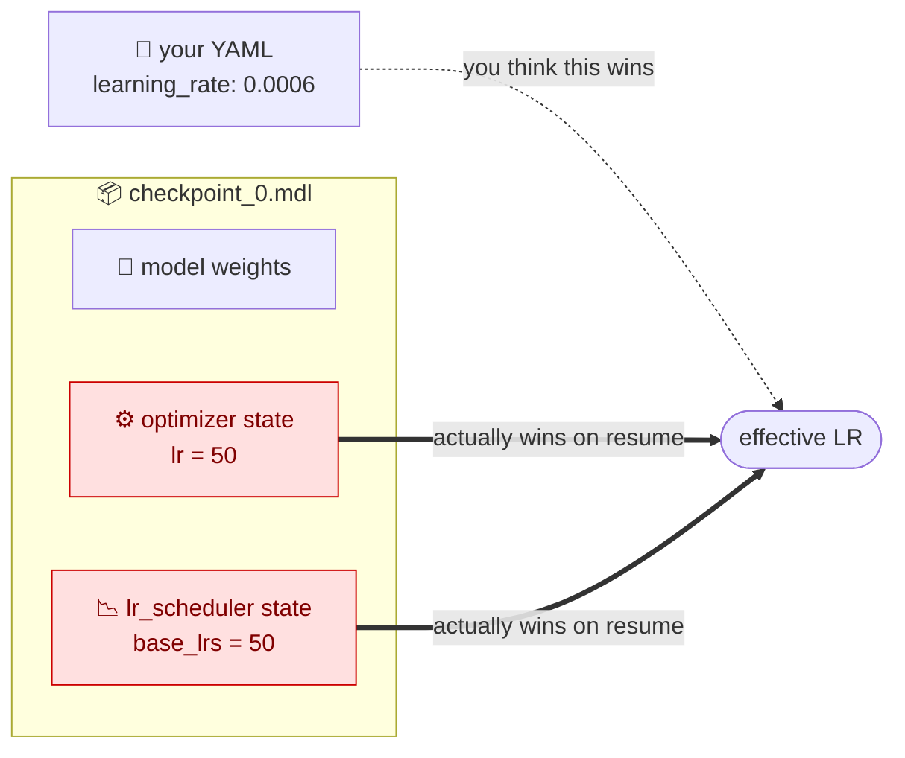

# 🧠 GPT-3 (111M) Training on Cerebras CS-3


In this hands-on you will launch a real GPT-3 training job on the wafer, **watch it break**, and
figure out how to fix it. The bug is a classic — and the *way* it resists your first fix is the real
lesson. 🎯

---

## 📥 1. Fetch the pre-compiled artifacts

```bash
mkdir ~/ATPESC/precompiled
cd ~/ATPESC/precompiled
cp -r /software/datasets/ATPESC .
cd ~/ATPESC/precompiled/modelzoo/src/cerebras/modelzoo/models/nlp/gpt3
```

## 🐍 2. Activate the PyTorch virtual environment

```bash
source ~/ATPESC/R_2.10.0/venv_cerebras_pt/bin/activate
```

## 🚀 3. Launch the training job

```bash
export MODEL_DIR=model_dir_gpt3_111m
cszoo fit configs/Cerebras_GPT/111m_modified.yaml --job_labels name=gpt3_111m --model_dir $MODEL_DIR |& tee mytest.log
```

> [!TIP]
> **Grab a coffee — the first ~5 minutes are staging, not training.** The compiled graph is cached
> on the cluster (look for `Found existing cached compile with hash …`), so you are *not* recompiling.
> The time goes to job scheduling + programming the wafer. The interesting part lands at **step 2**.

---

## 🧭 The road map for this lab



---

## ❓ Question Time

### 🧪 Q1 — What just happened?

Look at the last lines of your run (or `mytest.log`). **What error do you see? At which step? What was the loss?**

<details>
<summary>💡 Click to reveal what you should have seen</summary>

```text
| Train Device=CSX, Step=2, Loss=352299.56250, ...
ERROR: ... NaN error: NaN loss detected ...
cerebras.appliance.errors.ApplianceNanError: NaN loss detected. ...
```

- A healthy GPT-3 111M **starts near `loss ≈ ln(vocab) ≈ 11`**. By **step 2 it is 352,299** — the loss
  didn't drift, it *exploded*.
- `ApplianceNanError` is a **safety feature**: the trainer watches the loss and **auto-halts on NaN**
  so you don't waste wafer time.
</details>

### 🔧 Q2 — What would you change?

Which single hyperparameter is the culprit — and where is it in the config?

<details>
<summary>💡 Click to reveal</summary>

The **learning rate is far too high.** In `configs/Cerebras_GPT/111m_modified.yaml`, the warmup
scheduler starts at **50** (a healthy value here is `~6e-4`):

```yaml
schedulers:
- SequentialLR:
    schedulers:
    - LinearLR:
        initial_learning_rate: 50      # 👈 the bug — should start at 0.0 and warm up to ~6e-4
        end_learning_rate: 0.0006
        total_iters: 1525
```

Lower `initial_learning_rate` (e.g. back to `0.0`) and you've "fixed" the config… right? 😏
</details>

### 🔁 Q3 — Fix the LR, relaunch, and watch closely. **Did the error go away?**

Edit the LR, rerun the **same command into the same `model_dir`**, and observe.

<details>
<summary>😲 Click *after* you've run it</summary>

**No — it still NaNs!** Surprised? Good. Look at what the resume printed:

```text
Found latest checkpoint at "model_dir_gpt3_111m/checkpoint_0.mdl"
Optimizer state found in checkpoint and loaded successfully.
Scheduler state found in checkpoint and loaded successfully.   ← the culprit
```

> [!WARNING]
> **A checkpoint is not just weights.** It also carries the **optimizer** and **LR-scheduler** state —
> and that state pins the learning rate back to **50**. Autoloading it *overrides your YAML edit*, so
> the old LR comes right back.

**Prove it to yourself:** check the logged `lr` on this run — it's still ~50, not the value you typed.



**The takeaway:** *you cannot undo a bad learning rate by editing the YAML and resuming — the
checkpoint brings the old hyperparameters with it.*
</details>

---

## 🏠 Homework — make the new learning rate actually stick

**Your mission:** get the model to train with your lowered LR, and **prove it**.
> ✅ **Success =** the logged `lr` shows *your* new value **and** the loss goes **down** (no `ApplianceNanError`).

Two doors lead out. Try to find them before peeking. 🚪🚪

<details>
<summary>🔑 Hint</summary>

The problem is *restored state*, not your YAML. Either **don't resume at all**, or **resume but don't
restore the optimizer/scheduler**.
</details>

<details>
<summary>🚪 Door A — the simple one</summary>

**Use a fresh, empty `model_dir`.** No checkpoint → nothing to restore → your YAML LR is the only
source of truth → it trains. Because the compile cache is cluster-side (keyed by the model *graph*),
a fresh directory **still hits the cached compile** — no recompile, just the usual ~5-min staging.

```bash
export MODEL_DIR=model_dir_gpt3_111m_fixed   # 👈 a NEW directory
cszoo fit configs/Cerebras_GPT/111m_modified.yaml --job_labels name=gpt3_111m --model_dir $MODEL_DIR |& tee fixed.log
```
</details>

<details>
<summary>🚪 Door B — the "real engineer" one</summary>

**Keep resuming, but load only the weights.** Add the `LoadCheckpointStates` callback so the optimizer
and LR-scheduler are rebuilt from your YAML instead of the checkpoint:

```yaml
callbacks:
  - LoadCheckpointStates:
      load_checkpoint_states: "model"   # not optimizer / lr_scheduler / grad_scaler
```

`load_checkpoint_states` defaults to `"all"`; pass a comma-separated list of state names
(`model`, `optimizer`, `lr_scheduler`, `grad_scaler`, `dataloader`, …). This is the correct tool when
you want to keep **trained** weights but reset the learning rate.

> [!NOTE]
> Confirm the exact callback + state-name spelling for the ModelZoo release pinned on the cluster.
</details>

---

## 📚 Useful resources

- [ALCF Cerebras Documentation](https://docs.alcf.anl.gov/ai-testbed/cerebras/)
- [Cerebras Training Documentation](https://training-docs.cerebras.ai/)
- [Cerebras ModelZoo](https://github.com/Cerebras/modelzoo)

[⬅️ Back to the main guide](./README.md)
