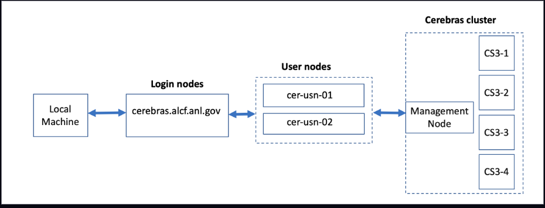

# Cerebras 

## Connection to a CS-3 node

Connection to one of the CS-3 cluster login nodes requires an MFA passcode for authentication - either an 8-digit passcode generated by an app on your mobile device (e.g. MobilePASS+) or a CRYPTOCard-generated passcode prefixed by a 4-digit pin. 



To connect to a CS-3 cluster, ssh to login nodes:
```bash
ssh ALCFUserID@cerebras.alcf.anl.gov
```
Next, ssh to a user node
```bash
ssh cer-usn-01
```
or
```bash
ssh cer-usn-02
```

## Create Virtual Environment 

### Clone Cerebras modelzoo

We use example from [Cerebras Modelzoo repository](https://github.com/Cerebras/modelzoo) for this hands-on. 
Clone the modezoo repository.<br>

```bash
mkdir ~/R_2.10.0
cd ~/R_2.10.0
export HTTPS_PROXY=http://proxy.alcf.anl.gov:3128
git clone https://github.com/Cerebras/modelzoo.git
cd modelzoo
git tag
git checkout Release_2.10.0
```

### PyTorch virtual environment
Create a PyTorch virtual environment for Cerebras
```bash
# Note: "deactivate" does not actually work in scripts.
deactivate
rm -r venv_cerebras_pt
/usr/bin/python3.11 -m venv venv_cerebras_pt
source venv_cerebras_pt/bin/activate
pip install --upgrade pip
pip install -e modelzoo
```

To activate a virtual environment
```bash
source ~/R_2.10.0/venv_cerebras_pt/bin/activate
```

To deactivate a virtual environment
```bash
deactivate
```

## Job Queuing and Submission

The CS-3 cluster has its own Kubernetes-based system for job submission and queuing. Jobs are started automatically through the Python scripts. 

Use Cerebras cluster command line tool to get addional information about the jobs.

* Jobs that have not yet completed can be listed as
    `(venv_pt) $ csctl get jobs`
* Jobs can be canceled as shown:
    `(venv_pt) $ csctl cancel job wsjob-eyjapwgnycahq9tus4w7id`

See `csctl -h` for more options.

## Hands-on Session Example

Instructions to run GPT-J and Llama2-7B.

* [GPT-J](./gpt-j.md)
* [LLAMA2-7B](./llama2-7b.md)


## Useful Resources 

* [ALCF Cerebras Documentation](https://docs.alcf.anl.gov/ai-testbed/cerebras/)
* [Cerebras Training Documntation](https://training-docs.cerebras.ai/rel-2.10.0/getting-started/overview)
* [Cerebras Modelzoo Repo](https://github.com/Cerebras/modelzoo/tree/main/modelzoo)

* Commonly used Datasets Path on system at ALCF: `/software/cerebras/dataset`
