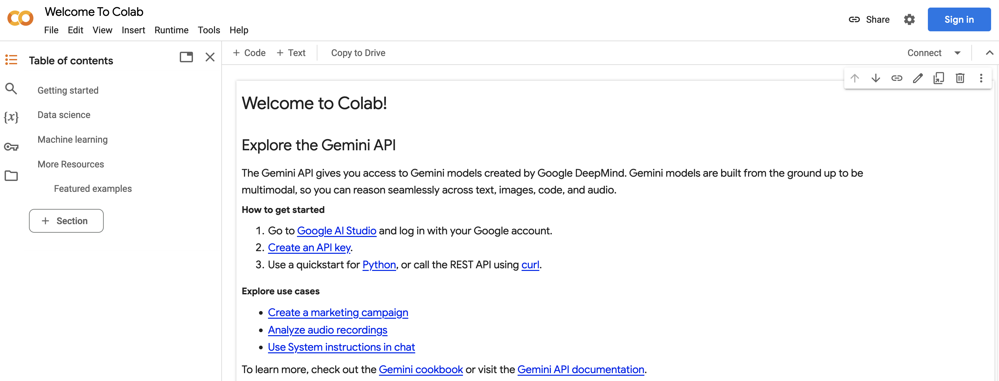
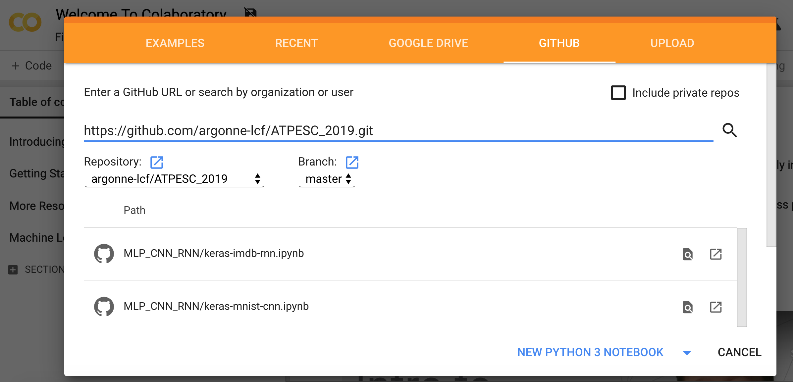

# [ATPESC 2025](https://extremecomputingtraining.anl.gov/atpesc-2025/)

## [Agenda](https://extremecomputingtraining.anl.gov/agenda-2025/#Track-3)

Time    | Talk                                                                                          | Speaker
|--     |--                                                                                             |--
8:30AM	|  Welcome and Introduction	                                                                    | Filippo Simini, ANL
8:40AM	|  Transition time: splitting into groups (people new to deep learning vs. more experienced)    |  	 	 	 
8:40AM	|  Parallel Session, Part 1 (talk/hands on):                                                    | 
|       |    - Main room: [Introduction to deep learning](01novice_intro_to_deep_learning)              | Bethany Lusch, ANL
|       |    - Breakout room: [Profiling deep learning](01advanced_profiling_deep_learning)             | Khalid Hossain, ANL
9:40AM	|  [Introduction to Large Language Models (LLMs)](02_intro_to_LLMs)	                            | Huihuo Zheng, ANL
10:40AM	|  *Break*                                                                                      |
11:10AM	|  [Distributed Deep Learning (talk/hands on) ](03_distributed_deep_learning)	                  | Nathan Nichols, ANL Kaushik Velusamy, ANL
12:30PM	|  *Lunch*                                                                                      |
1:30PM	|  Research talk                                                                                | Sandeep Madireddy, ANL
2:00PM	|  [AI Testbed (talk/hands on)](04_AI_testbed)                                                  | Sid Raskar, PNNL
3:00PM	|  [LLM inference (talk/hands on)](05_LLM_inference)                                            | Sid Raskar, PNNL
3:50PM	|  *Break*                                                                                      |
4:20PM	|  [Training LLMs at Scale (talk/hands on)](06_training_LLMs_at_scale)                          | Shilpika, ANL
5:20PM	|  [Workflow management tools to couple simulation and AI (talk/hands on)](07_workflows_coupling_simulation_and_AI)                        | Christine Simpson, ANL
6:30PM	|  *Dinner*

At the beginning of the day, we will temporarily split into two groups. Attendees can choose between [Introduction to deep learning](01novice_intro_to_deep_learning) and [Profiling deep learning](01advanced_profiling_deep_learning).  

The "Introduction to deep learning" session will rely on Jupyter Notebooks which are targeted for running on [Google's Colaboratory Platform](https://colab.research.google.com) or [ALCF JupyterHub](https://jupyter.alcf.anl.gov/). The Colab platform gives the user a virtual machine in which to run Python codes including machine learning codes. The VM comes with a preinstalled environment that includes most of what is needed for these tutorials.

The other sessions involve Python scripts executed on the [Aurora](https://docs.alcf.anl.gov/aurora/getting-started-on-aurora/) and [AI Testbed](https://docs.alcf.anl.gov/ai-testbed/) platforms at ALCF. 

## Reservations

- **Queue**: ATPESC (`-q ATPESC`)
- **Project/Allocation**: ATPESC2025 (`-A ATPESC2025`)
- Shared **directories**:
    - Aurora: `/flare/ATPESC2025`
    - Polaris: `/eagle/projects/ATPESC2025`

## Using Google Colab

Google Colab involves running Jupyter notebooks, which you will also be using next week. 

Do the following before you come to the tutorial:
*  You need a Google Account to use Colaboratory
*  Go to [Google's Colaboratory Platform](https://colab.research.google.com) 
*  You should see this page

*  Now you can open the `File` menu at the top left and select `Open Notebook` which will open a dialogue box.
*  Select the `GitHub` tab in the dialogue box.
*  From here you can enter the url for the github repo: `https://github.com/argonne-lcf/ATPESC_MachineLearning` and hit `<enter>`.

*  This will show you a list of the Notebooks available in the repo. When you select a notebook from this list it will create a copy for you in your Colaboratory account (all `*.ipynb` files in the Colaboratory account will be stored in your Google Drive).
* To use a GPU in the notbook select `Runtime` -> `Change Runtime Type` and select an accelerator.
