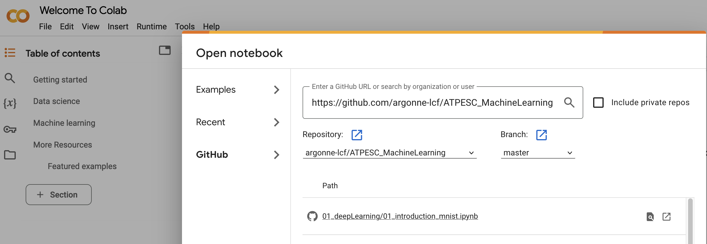

# [ATPESC 2025](https://extremecomputingtraining.anl.gov/agenda-2025/)

At the beginning of the day, we will temporarily split into two groups. Attendees can choose between [Introduction to deep learning](01novice_intro_to_deep_learning) and [Profiling deep learning](01advanced_profiling_deep_learning).  

The "Introduction to deep learning" session will rely on Jupyter Notebooks which are targeted for running on [Google's Colaboratory Platform](https://colab.research.google.com) or [ALCF JupyterHub](https://www.alcf.anl.gov/support-center/theta/jupyter-hub). The Colab platform gives the user a virtual machine in which to run Python codes including machine learning codes. The VM comes with a preinstalled environment that includes most of what is needed for these tutorials.

The other sessions involve Python scripts executed on the [Aurora](https://docs.alcf.anl.gov/aurora/getting-started-on-aurora/) and [AI Testbed](https://docs.alcf.anl.gov/ai-testbed/) platforms at ALCF. 

## Using Google Colab

Google Colab involves running Jupyter notebooks, which you have experience with from earlier in the week. 

Do the following before you come to the tutorial:
*  You need a Google Account to use Colaboratory
*  Go to [Google's Colaboratory Platform](https://colab.research.google.com) 
*  You should see this page

*  Now you can open the `File` menu at the top left and select `Open Notebook` which will open a dialogue box.
*  Select the `GitHub` tab in the dialogue box.
*  From here you can enter the url for the github repo: `https://github.com/argonne-lcf/ATPESC_MachineLearning` and hit `<enter>`.

*  This will show you a list of the Notebooks available in the repo. When you select a notebook from this list it will create a copy for you in your Colaboratory account (all `*.ipynb` files in the Colaboratory account will be stored in your Google Drive).
* To use a GPU in the notbook select `Runtime` -> `Change Runtime Type` and select an accelerator.
